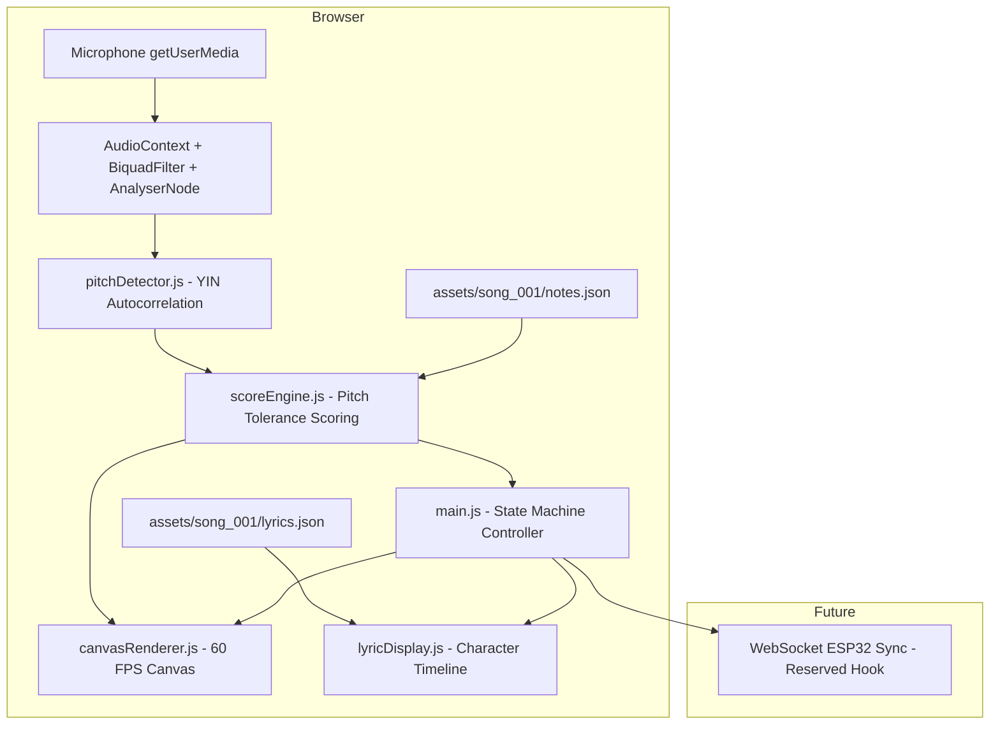
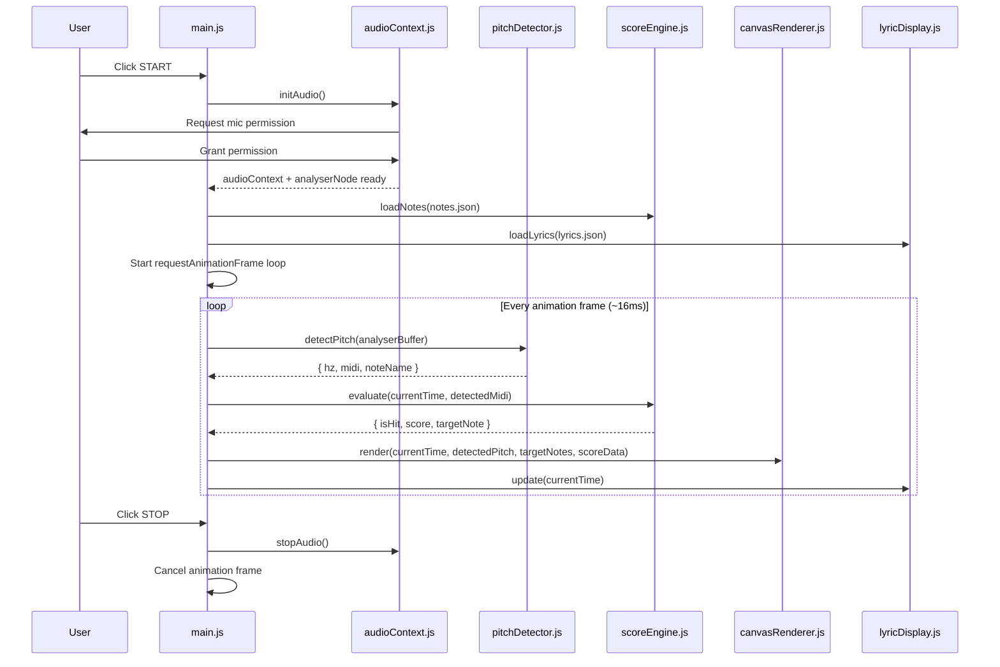
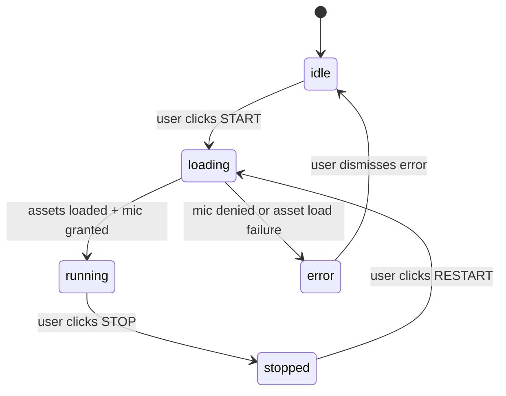

# Design Document: Real-Time Karaoke Scoring & Multimedia Web Engine (ktv-smart-scorer)

## Overview

A serverless, browser-edge-based proof-of-concept that captures a user's live singing via the microphone, extracts the fundamental frequency (f0) using a hand-rolled YIN/autocorrelation algorithm, and compares it against pre-loaded MIDI note data to produce real-time pitch-accuracy scores. The entire pipeline runs in native browser APIs (Web Audio API + HTML5 Canvas + ES modules) with zero build tools and zero heavy dependencies, rendering 60 FPS scrolling pitch bars and hit-feedback visuals on a dark KTV aesthetic UI.

The system is designed with clean module boundaries so that a future WebSocket/ESP32 sync layer can be bolted on without touching the core audio or scoring logic.

---

## Architecture



### Data Flow



---

## Components and Interfaces

### Component 1: audioContext.js

**Purpose**: Manages the entire Web Audio API pipeline — mic acquisition, bandpass filtering, RMS-based noise gating, and feeding time-domain samples to the pitch detector.

**Interface**:
```javascript
/**
 * Initialises AudioContext, requests mic permission, wires up
 * BiquadFilterNode (bandpass 80Hz–1200Hz) → AnalyserNode chain.
 * @returns {Promise<AudioPipelineResult>}
 */
async function initAudio()

/**
 * Reads the latest time-domain sample buffer from the AnalyserNode.
 * Applies RMS-based noise gate: returns null if signal is below threshold.
 * @param {AnalyserNode} analyserNode
 * @param {Float32Array} buffer - reusable buffer, length = fftSize
 * @param {number} rmsThreshold - 0.0–1.0, default 0.01
 * @returns {Float32Array | null}
 */
function getFilteredBuffer(analyserNode, buffer, rmsThreshold)

/**
 * Tears down the audio pipeline: stops mic tracks, closes AudioContext.
 * @param {AudioPipelineResult} pipeline
 * @returns {void}
 */
function stopAudio(pipeline)
```

**AudioPipelineResult type**:
```javascript
// {
//   audioContext: AudioContext,
//   analyserNode: AnalyserNode,
//   sourceNode: MediaStreamAudioSourceNode,
//   stream: MediaStream,
//   buffer: Float32Array    // reusable FFT buffer, length = analyserNode.fftSize
// }
```

**Responsibilities**:
- Call `navigator.mediaDevices.getUserMedia({ audio: true })`
- Create `BiquadFilterNode` with `type = 'bandpass'`, `frequency = 440`, `Q = 3.5` (effective 80–1200 Hz pass)
- Connect chain: `sourceNode → filterNode → analyserNode`
- Expose `getFilteredBuffer()` which checks RMS before returning the buffer
- Provide `stopAudio()` for clean teardown

---

### Component 2: pitchDetector.js

**Purpose**: Implements a lightweight YIN-inspired autocorrelation algorithm to extract the fundamental frequency (f0) from a PCM time-domain buffer. Converts Hz to MIDI note number and note name.

**Interface**:
```javascript
/**
 * Runs autocorrelation-based f0 detection on a PCM buffer.
 * Returns null if no confident pitch is found (signal too weak or noisy).
 * @param {Float32Array} buffer - PCM samples (mono, float32 -1.0..1.0)
 * @param {number} sampleRate - e.g. 44100 or 48000
 * @param {Object} [options]
 * @param {number} [options.minHz=80]   - lower search bound
 * @param {number} [options.maxHz=1200] - upper search bound
 * @param {number} [options.clarityThreshold=0.9] - normalised correlation threshold
 * @returns {PitchResult | null}
 */
function detectPitch(buffer, sampleRate, options)

/**
 * Converts a frequency in Hz to the nearest MIDI note number (0–127).
 * @param {number} hz
 * @returns {number} midi note number
 */
function hzToMidi(hz)

/**
 * Converts a MIDI note number to a human-readable note name (e.g. "C3", "G#4").
 * @param {number} midi
 * @returns {string}
 */
function midiToNoteName(midi)
```

**PitchResult type**:
```javascript
// {
//   hz: number,       // detected fundamental frequency
//   midi: number,     // nearest MIDI note number (rounded)
//   midiExact: number,// continuous MIDI value (for sub-semitone tolerance)
//   noteName: string  // e.g. "C3"
// }
```

**Algorithm — Autocorrelation (YIN-inspired)**:
```javascript
// ALGORITHM detectPitch(buffer, sampleRate, options)
// INPUT: buffer (Float32Array), sampleRate (number), options
// OUTPUT: PitchResult | null
//
// 1. Compute autocorrelation for lags τ in [sampleRate/maxHz, sampleRate/minHz]
//    r[τ] = Σ buffer[i] * buffer[i + τ]  for i in 0..N-τ
//
// 2. Find the lag τ_best that maximises r[τ]
//    — normalise by r[0] to get clarity score c = r[τ_best] / r[0]
//
// 3. IF c < clarityThreshold THEN return null (no confident pitch)
//
// 4. Refine τ_best with parabolic interpolation for sub-sample accuracy
//
// 5. f0 = sampleRate / τ_best
//    midi = 69 + 12 * log2(f0 / 440)
//    noteName = NOTE_NAMES[midi % 12] + octave
//
// 6. RETURN { hz: f0, midi: round(midi), midiExact: midi, noteName }
```

**Responsibilities**:
- Pure function with no side effects — takes a buffer, returns a result
- Works within 80–1200 Hz bounds (matching bandpass filter)
- Sub-semitone accuracy via parabolic interpolation
- Export `detectPitch`, `hzToMidi`, `midiToNoteName` as named ES module exports

---

### Component 3: scoreEngine.js

**Purpose**: Loads MIDI note timeline data, evaluates the user's detected pitch against the current target note(s), and accumulates a session score.

**Interface**:
```javascript
/**
 * Loads and parses the notes.json asset.
 * @param {NoteEntry[]} notes - parsed JSON array
 * @returns {ScoreEngineState}
 */
function initScoreEngine(notes)

/**
 * Given the current playback time and the user's detected MIDI pitch,
 * returns the evaluation result and updates the score state.
 * @param {ScoreEngineState} state
 * @param {number} currentTimeMs - performance.now()-relative milliseconds
 * @param {number | null} detectedMidiExact - null if no pitch detected
 * @returns {EvaluationResult}
 */
function evaluate(state, currentTimeMs, detectedMidiExact)

/**
 * Returns the set of note entries that overlap with a given time window.
 * Used by the canvas renderer for lookahead rendering.
 * @param {ScoreEngineState} state
 * @param {number} currentTimeMs
 * @param {number} windowMs - how far ahead to look (e.g. 3000ms)
 * @returns {NoteEntry[]}
 */
function getVisibleNotes(state, currentTimeMs, windowMs)
```

**NoteEntry type** (from notes.json):
```javascript
// {
//   start: number,  // ms from song start
//   end: number,    // ms from song start
//   pitch: number,  // MIDI note number
//   note: string    // human-readable e.g. "C3"
// }
```

**ScoreEngineState type**:
```javascript
// {
//   notes: NoteEntry[],
//   score: number,          // accumulated score
//   totalHits: number,
//   totalEvaluations: number,
//   lastResult: EvaluationResult | null
// }
```

**EvaluationResult type**:
```javascript
// {
//   isHit: boolean,
//   isInWindow: boolean,   // true if there is an active target note at this time
//   targetNote: NoteEntry | null,
//   detectedMidiExact: number | null,
//   semitoneError: number | null,  // distance from target in semitones
//   score: number                  // current accumulated score
// }
```

**Scoring Logic**:
- Hit = `|detectedMidiExact - targetNote.pitch| <= 0.5`
- Score increments by +10 per hit frame
- No negative scoring (misses simply don't add points)

**Responsibilities**:
- Determine the active note at `currentTimeMs` by scanning `notes` array
- Apply ±0.5 semitone tolerance for hit detection
- Keep running totals of score, hits, and evaluations
- Provide lookahead window for canvas rendering

---

### Component 4: canvasRenderer.js

**Purpose**: Renders the 60 FPS scrolling pitch visualization on an HTML5 Canvas element. Draws target note bars scrolling right-to-left, the user's live pitch dot, and a glowing "hit" effect.

**Interface**:
```javascript
/**
 * Initialises the renderer with a canvas element and display config.
 * @param {HTMLCanvasElement} canvas
 * @param {RendererConfig} config
 * @returns {RendererState}
 */
function initRenderer(canvas, config)

/**
 * Renders a single frame. Called from the requestAnimationFrame loop.
 * @param {RendererState} state
 * @param {number} currentTimeMs
 * @param {NoteEntry[]} visibleNotes      - from scoreEngine.getVisibleNotes()
 * @param {PitchResult | null} pitchResult
 * @param {EvaluationResult} evalResult
 * @returns {void}
 */
function renderFrame(state, currentTimeMs, visibleNotes, pitchResult, evalResult)

/**
 * Resizes the canvas to match the display element's CSS size.
 * Should be called on window resize.
 * @param {RendererState} state
 * @returns {void}
 */
function resizeCanvas(state)
```

**RendererConfig type**:
```javascript
// {
//   midiMin: number,       // lowest MIDI note shown (default 48 = C3)
//   midiMax: number,       // highest MIDI note shown (default 84 = C6)
//   scrollSpeedPxPerMs: number, // how fast bars scroll left (default 0.15 px/ms)
//   lookaheadMs: number,   // how far right bars appear before they're due (default 3000)
//   barHeight: number,     // px height of each MIDI pitch bar (default 12)
//   colors: {
//     background: string,  // default "#111"
//     targetBar: string,   // default "#2a5298"
//     targetBarHit: string,// default "#4fc3f7" (lit up when hit)
//     pitchDot: string,    // default "#f0c040"
//     hitGlow: string,     // default "rgba(79,195,247,0.5)"
//     gridLine: string     // default "rgba(255,255,255,0.05)"
//   }
// }
```

**Rendering Pipeline (per frame)**:
```javascript
// 1. Clear canvas (fillRect background)
// 2. Draw horizontal grid lines at each MIDI note row
// 3. For each visibleNote:
//    a. Compute x position: xRight + (note.start - currentTimeMs) * scrollSpeedPxPerMs
//    b. Compute y position: midiToY(note.pitch)
//    c. Draw filled rect (width = (note.end - note.start) * scrollSpeedPxPerMs)
//    d. If evalResult.isHit and note === targetNote → draw glow effect
// 4. If pitchResult !== null:
//    a. Draw bright dot at (xCenter, midiToY(pitchResult.midiExact))
// 5. Draw score overlay (top-right)
```

**Responsibilities**:
- Convert MIDI note number to Y coordinate: `y = canvas.height - ((midi - midiMin) / (midiMax - midiMin)) * canvas.height`
- Draw horizontal note bars with correct timing offsets
- Draw live pitch dot in a consistent horizontal lane (e.g. 40% from left)
- Apply glow/shadow effect on hit frames
- Handle canvas resize (DPR-aware for retina screens)

---

### Component 5: lyricDisplay.js

**Purpose**: Drives the per-character karaoke subtitle color-change effect using a timeline from lyrics.json.

**Interface**:
```javascript
/**
 * Initialises the lyric display with a DOM container element and lyric data.
 * @param {HTMLElement} container
 * @param {LyricLine[]} lyrics
 * @returns {LyricState}
 */
function initLyricDisplay(container, lyrics)

/**
 * Updates which characters are highlighted based on currentTimeMs.
 * Should be called from the rAF loop alongside renderFrame.
 * @param {LyricState} state
 * @param {number} currentTimeMs
 * @returns {void}
 */
function updateLyrics(state, currentTimeMs)

/**
 * Resets all lyric highlighting (e.g. on STOP).
 * @param {LyricState} state
 * @returns {void}
 */
function resetLyrics(state)
```

**LyricLine type** (from lyrics.json):
```javascript
// {
//   lineId: number,
//   text: string,        // full line text
//   chars: LyricChar[]   // per-character timing
// }

// LyricChar:
// {
//   char: string,
//   start: number,  // ms - when this char turns active (highlighted)
//   end: number     // ms
// }
```

**Responsibilities**:
- Render each lyric line as a `<p>` where each character is wrapped in a `<span>`
- Toggle an `active` CSS class on each span when `currentTimeMs` is between `start` and `end`
- Efficiently update only spans whose state needs to change (avoid full re-render)

---

### Component 6: main.js

**Purpose**: Master controller — state machine, asset loading, rAF loop, and wiring all modules together. Exposes reserved hook points for future ESP32 WebSocket sync.

**Interface** (internal state machine):
```javascript
// States: 'idle' | 'loading' | 'running' | 'stopped' | 'error'

/**
 * Entry point — attaches event listeners and starts the state machine.
 * Called on DOMContentLoaded.
 */
function init()

/**
 * Transitions 'idle' → 'loading' → 'running'.
 * Loads assets, inits audio, starts rAF loop.
 */
async function start()

/**
 * Transitions 'running' → 'stopped'.
 * Cancels rAF, stops audio, shows final score.
 */
function stop()

/**
 * The rAF callback — called ~60 times per second.
 * Orchestrates pitch detection → score evaluation → rendering.
 * @param {DOMHighResTimeStamp} timestamp
 */
function onAnimationFrame(timestamp)

// --- Reserved hook for future ESP32 WebSocket sync ---
/**
 * RESERVED: Will be called on each evaluation result to push
 * score/pitch data to a WebSocket connection for ESP32 display sync.
 * Currently a no-op stub.
 * @param {EvaluationResult} evalResult
 */
function onSyncTick(evalResult)
```

**State Machine**:


---

## Data Models

### notes.json Schema

```javascript
// Array of NoteEntry:
[
  {
    "start": 0,       // number — ms from song start (integer)
    "end": 1000,      // number — ms from song start (integer, > start)
    "pitch": 48,      // number — MIDI note number (integer, 0–127)
    "note": "C3"      // string — human-readable note name
  }
  // ...
]
```

**Validation Rules**:
- `start >= 0` and `end > start`
- `pitch` is an integer in [0, 127]
- `note` matches the expected name for `pitch` (e.g., MIDI 48 = "C3")
- No overlapping note windows (notes are non-overlapping, sequential)

**Sample test scale (C3–G3)**:
```json
[
  { "start": 0,    "end": 1000, "pitch": 48, "note": "C3" },
  { "start": 1000, "end": 2000, "pitch": 50, "note": "D3" },
  { "start": 2000, "end": 3000, "pitch": 52, "note": "E3" },
  { "start": 3000, "end": 4000, "pitch": 53, "note": "F3" },
  { "start": 4000, "end": 5000, "pitch": 55, "note": "G3" }
]
```

### lyrics.json Schema

```javascript
// Array of LyricLine:
[
  {
    "lineId": 1,
    "text": "Hello world",
    "chars": [
      { "char": "H", "start": 0,   "end": 200  },
      { "char": "e", "start": 200, "end": 400  }
      // ...
    ]
  }
]
```

### Debug Panel Data (UI state, not persisted)

```javascript
// {
//   detectedNote: string | null,   // e.g. "C3"
//   detectedHz: number | null,     // e.g. 130.8
//   currentScore: number,          // e.g. 420
//   isHit: boolean,
//   targetNote: string | null      // e.g. "D3"
// }
```

---

## Algorithmic Pseudocode

### YIN Autocorrelation — Core Algorithm

```javascript
// ALGORITHM detectPitch(buffer, sampleRate, options)
// INPUT:  buffer: Float32Array (N samples, -1.0..1.0)
//         sampleRate: number (Hz)
//         options: { minHz, maxHz, clarityThreshold }
// OUTPUT: PitchResult | null
//
// PRECONDITIONS:
//   buffer.length >= 2 * (sampleRate / minHz)   // enough samples for lowest frequency
//   0 < minHz < maxHz <= sampleRate / 2          // valid frequency range
//   0 < clarityThreshold <= 1.0
//
// POSTCONDITIONS:
//   IF result !== null: result.hz is in [minHz, maxHz]
//   IF result !== null: result.midi = round(69 + 12*log2(result.hz/440))
//   IF result === null: signal has no confident pitch (clarity < threshold)

function detectPitch(buffer, sampleRate, { minHz=80, maxHz=1200, clarityThreshold=0.9 }) {
  const N = buffer.length
  const tauMin = Math.floor(sampleRate / maxHz)
  const tauMax = Math.floor(sampleRate / minHz)

  // Step 1: Compute autocorrelation for each lag τ
  let bestTau = -1
  let bestCorrelation = 0

  const r0 = autocorrelate(buffer, 0)   // normalisation term

  for (let tau = tauMin; tau <= tauMax; tau++) {
    // LOOP INVARIANT: bestCorrelation is the maximum normalised correlation seen so far
    //                 for all τ' in [tauMin, tau)
    const r = autocorrelate(buffer, tau)
    const normalised = r / r0
    if (normalised > bestCorrelation) {
      bestCorrelation = normalised
      bestTau = tau
    }
  }

  // Step 2: Check clarity threshold
  if (bestCorrelation < clarityThreshold) return null

  // Step 3: Parabolic interpolation for sub-sample accuracy
  const refinedTau = parabolicInterpolate(buffer, bestTau, sampleRate)

  // Step 4: Convert to Hz and MIDI
  const hz = sampleRate / refinedTau
  const midiExact = 69 + 12 * Math.log2(hz / 440)
  const midi = Math.round(midiExact)
  const noteName = midiToNoteName(midi)

  return { hz, midi, midiExact, noteName }
}

// Helper: sum of products for lag τ
function autocorrelate(buffer, tau) {
  let sum = 0
  for (let i = 0; i < buffer.length - tau; i++) {
    sum += buffer[i] * buffer[i + tau]
  }
  return sum
}
```

### RMS Noise Gate

```javascript
// ALGORITHM getFilteredBuffer(analyserNode, buffer, rmsThreshold)
// INPUT:  analyserNode: AnalyserNode
//         buffer: Float32Array (reused across calls)
//         rmsThreshold: number (0.0..1.0)
// OUTPUT: Float32Array | null
//
// POSTCONDITIONS:
//   IF result !== null: RMS(result) >= rmsThreshold (signal is loud enough)
//   IF result === null: RMS(buffer) < rmsThreshold (signal gated out)

function getFilteredBuffer(analyserNode, buffer, rmsThreshold = 0.01) {
  analyserNode.getFloatTimeDomainData(buffer)

  // Compute RMS
  let sumSq = 0
  for (let i = 0; i < buffer.length; i++) {
    sumSq += buffer[i] * buffer[i]
  }
  const rms = Math.sqrt(sumSq / buffer.length)

  return rms >= rmsThreshold ? buffer : null
}
```

### Score Evaluation

```javascript
// ALGORITHM evaluate(state, currentTimeMs, detectedMidiExact)
// INPUT:  state: ScoreEngineState
//         currentTimeMs: number (performance.now() offset)
//         detectedMidiExact: number | null
// OUTPUT: EvaluationResult
//
// PRECONDITIONS:
//   state.notes is sorted by start time (ascending)
//   currentTimeMs >= 0
//
// POSTCONDITIONS:
//   IF result.isHit: state.score increased by +10
//   IF result.isHit: state.totalHits increased by 1
//   result.isHit is true IFF: result.isInWindow AND detectedMidiExact !== null
//                              AND |detectedMidiExact - targetNote.pitch| <= 0.5
//   state.totalEvaluations increased by 1

function evaluate(state, currentTimeMs, detectedMidiExact) {
  state.totalEvaluations++

  // Find the active note for this timestamp
  const targetNote = state.notes.find(
    n => currentTimeMs >= n.start && currentTimeMs < n.end
  ) ?? null

  if (!targetNote || detectedMidiExact === null) {
    state.lastResult = { isHit: false, isInWindow: !!targetNote, targetNote,
                         detectedMidiExact, semitoneError: null, score: state.score }
    return state.lastResult
  }

  const semitoneError = Math.abs(detectedMidiExact - targetNote.pitch)
  const isHit = semitoneError <= 0.5

  if (isHit) {
    state.score += 10
    state.totalHits++
  }

  state.lastResult = { isHit, isInWindow: true, targetNote,
                       detectedMidiExact, semitoneError, score: state.score }
  return state.lastResult
}
```

---

## Key Functions with Formal Specifications

### `detectPitch(buffer, sampleRate, options)`

**Preconditions:**
- `buffer` is a non-empty `Float32Array` with values in [-1.0, 1.0]
- `buffer.length >= 2 * (sampleRate / minHz)` (enough samples to detect the lowest frequency)
- `0 < options.minHz < options.maxHz <= sampleRate / 2`
- `0 < options.clarityThreshold <= 1.0`

**Postconditions:**
- If `result !== null`: `result.hz` is within `[minHz, maxHz]`
- If `result !== null`: `result.midi === Math.round(69 + 12 * Math.log2(result.hz / 440))`
- If `result !== null`: `result.noteName` correctly encodes `result.midi`
- If `result === null`: no confident pitch was found (signal below clarity threshold)
- No mutation of input `buffer`

**Loop Invariants (main tau loop):**
- `bestCorrelation` is the maximum normalised correlation for all `τ` in `[tauMin, currentTau)`
- `bestTau` is the lag producing `bestCorrelation`

---

### `evaluate(state, currentTimeMs, detectedMidiExact)`

**Preconditions:**
- `state.notes` is sorted by `start` time ascending and has no overlapping intervals
- `currentTimeMs >= 0`
- `detectedMidiExact` is either `null` or a number in `[0, 127]`

**Postconditions:**
- `state.totalEvaluations` increases by exactly 1
- `result.isHit` is `true` if and only if: there is a target note covering `currentTimeMs`, `detectedMidiExact !== null`, and `|detectedMidiExact - targetNote.pitch| <= 0.5`
- If `result.isHit`: `state.score` increases by exactly 10, `state.totalHits` increases by 1
- If `!result.isHit`: `state.score` and `state.totalHits` remain unchanged

---

### `getFilteredBuffer(analyserNode, buffer, rmsThreshold)`

**Preconditions:**
- `analyserNode` is connected and receiving live audio
- `buffer.length === analyserNode.fftSize`
- `0.0 <= rmsThreshold <= 1.0`

**Postconditions:**
- If result is non-null: `RMS(result) >= rmsThreshold`
- If result is null: `RMS(buffer) < rmsThreshold`
- `buffer` is always populated with the latest samples (side effect: read from AnalyserNode)

---

## Example Usage

```javascript
// ---- main.js orchestration ----

import { initAudio, getFilteredBuffer, stopAudio } from './audio/audioContext.js'
import { detectPitch } from './audio/pitchDetector.js'
import { initScoreEngine, evaluate, getVisibleNotes } from './scoring/scoreEngine.js'
import { initRenderer, renderFrame } from './ui/canvasRenderer.js'
import { initLyricDisplay, updateLyrics } from './ui/lyricDisplay.js'

let pipeline, scoreState, rendererState, lyricState
let rafId, startTime

async function start() {
  // 1. Load assets
  const [notes, lyrics] = await Promise.all([
    fetch('./assets/song_001/notes.json').then(r => r.json()),
    fetch('./assets/song_001/lyrics.json').then(r => r.json())
  ])

  // 2. Init audio pipeline
  pipeline = await initAudio()

  // 3. Init modules
  scoreState = initScoreEngine(notes)
  rendererState = initRenderer(document.getElementById('pitch-canvas'), {
    midiMin: 36, midiMax: 72,
    scrollSpeedPxPerMs: 0.15,
    lookaheadMs: 3000
  })
  lyricState = initLyricDisplay(document.getElementById('lyric-container'), lyrics)

  // 4. Mark start time
  startTime = performance.now()

  // 5. Start rAF loop
  rafId = requestAnimationFrame(onAnimationFrame)
}

function onAnimationFrame(timestamp) {
  const currentTimeMs = timestamp - startTime

  // Detect pitch
  const filtered = getFilteredBuffer(pipeline.analyserNode, pipeline.buffer)
  const pitchResult = filtered
    ? detectPitch(filtered, pipeline.audioContext.sampleRate)
    : null

  // Score
  const evalResult = evaluate(scoreState, currentTimeMs,
                               pitchResult?.midiExact ?? null)

  // Render
  const visibleNotes = getVisibleNotes(scoreState, currentTimeMs, 3000)
  renderFrame(rendererState, currentTimeMs, visibleNotes, pitchResult, evalResult)
  updateLyrics(lyricState, currentTimeMs)

  // Update debug panel
  updateDebugPanel(pitchResult, evalResult)

  // Sync hook (reserved for ESP32)
  onSyncTick(evalResult)

  rafId = requestAnimationFrame(onAnimationFrame)
}

// Reserved ESP32 sync hook — no-op for Phase 1
function onSyncTick(evalResult) {
  // TODO Phase 2: push evalResult via WebSocket to ESP32 display
}
```

---

## Error Handling

### Error Scenario 1: Microphone Permission Denied

**Condition**: `getUserMedia()` rejects with `NotAllowedError`
**Response**: Transition state machine to `error`, display a user-friendly message on the UI ("Microphone access is required. Please allow mic permission and try again.")
**Recovery**: User clicks "Dismiss" → state transitions back to `idle`, START button re-enabled

### Error Scenario 2: Asset Load Failure

**Condition**: `fetch()` for `notes.json` or `lyrics.json` fails (404, network error)
**Response**: Transition to `error` state, display message with file name and error
**Recovery**: User refreshes the page; files must be present to proceed

### Error Scenario 3: AudioContext Suspended (Autoplay Policy)

**Condition**: Browser suspends `AudioContext` before first user gesture
**Response**: Ensure `initAudio()` is always called from within a user interaction event handler (click), which satisfies browser autoplay policies
**Recovery**: No special recovery needed; architecture naturally avoids this by only creating `AudioContext` on button click

### Error Scenario 4: No Confident Pitch Detected

**Condition**: `detectPitch()` returns `null` (weak signal or noise)
**Response**: `evaluate()` treats this as a miss (no hit, no score increment). Canvas renders the pitch dot as absent. Debug panel shows "—" for note and Hz.
**Recovery**: Normal operation — this is expected behavior during silence or noise

### Error Scenario 5: Canvas Not Supported

**Condition**: `getContext('2d')` returns null
**Response**: Display a text fallback message; continue audio pipeline (score still accumulates)
**Recovery**: User must use a browser with Canvas support

---

## Testing Strategy

### Unit Testing Approach

Since the project has no build tools, testing will use the native browser's ES module support or a lightweight test runner (e.g., [uvu](https://github.com/lukeed/uvu) or browser-based assertion scripts).

Key unit test targets:
- `hzToMidi()` — verify standard note frequencies map to correct MIDI numbers
- `midiToNoteName()` — verify all 128 MIDI values produce correct names
- `evaluate()` — test hit/miss boundary conditions at exactly ±0.5 semitones
- `getVisibleNotes()` — test time window filtering logic
- `getFilteredBuffer()` — test RMS threshold behavior

### Property-Based Testing Approach

**Property Test Library**: fast-check (CDN import, no bundler required)

Properties to test (see Correctness Properties section):
1. Pitch detection round-trip: `hzToMidi(midiToHz(n)) === n` for all valid MIDI values
2. Score monotonicity: score never decreases
3. Hit detection boundary: hits only within ±0.5 semitones
4. Note name consistency: `midiToNoteName(hzToMidi(hz))` is stable for all in-range Hz values

### Integration Testing Approach

Manual browser testing:
- Open `index.html` directly (file:// or local HTTP server)
- Verify mic permission flow
- Sing a C3 scale and observe pitch bars and score
- Verify lyric color-change timing

---

## Performance Considerations

- **Buffer size**: `AnalyserNode.fftSize = 2048` at 44100 Hz → ~46ms per buffer → sufficient for pitch detection latency under 50ms
- **Autocorrelation complexity**: O(N × τ_range) per frame. With N=2048 and τ_range≈400, this is ~800K multiplications per frame. At 60 FPS this is well within a single-core browser budget (< 2ms on modern hardware)
- **Canvas rendering**: Use `clearRect` + direct drawing (no off-screen canvas needed for MVP). All drawing is done in a single `requestAnimationFrame` callback
- **Reuse Float32Array buffer**: Allocate once in `initAudio()` and reuse on every frame to avoid GC pressure
- **Lyric DOM updates**: Only toggle CSS classes when state changes (don't re-render all spans every frame)

---

## Security Considerations

- **Mic permission**: The browser's native permission system handles consent. No audio data leaves the browser.
- **Asset fetching**: Notes and lyrics JSON are loaded from same-origin relative paths. No external network requests.
- **No server**: The application is fully client-side. There is no server-side attack surface for Phase 1.
- **Future WebSocket (ESP32 sync)**: When implemented, the WebSocket connection should use WSS (TLS) and the ESP32 endpoint should be configurable (not hardcoded to an IP), with appropriate CORS/origin validation on the server side.

---

## Dependencies

| Dependency | Version | Purpose | Load Method |
|---|---|---|---|
| None (Web Audio API) | Browser-native | Audio pipeline | Browser built-in |
| None (HTML5 Canvas) | Browser-native | Visual rendering | Browser built-in |
| None (ES Modules) | Browser-native | Module system | `<script type="module">` |
| fast-check (optional, testing only) | Latest CDN | Property-based testing | CDN `<script>` in test HTML |

**No npm, no webpack, no Vite, no React.**

---

## Correctness Properties

*A property is a characteristic or behavior that should hold true across all valid executions of a system — essentially, a formal statement about what the system should do. Properties serve as the bridge between human-readable specifications and machine-verifiable correctness guarantees.*

### Property 1: MIDI↔Hz Round Trip

For any valid MIDI note number `n` in [0, 127], converting to Hz and back to MIDI shall produce the same value: `hzToMidi(midiToHz(n)) === n`.

**Validates: Requirements 6.1, 6.2**

### Property 2: Score Monotonicity

For any sequence of `evaluate()` calls on the same `ScoreEngineState`, `state.score` shall never decrease between consecutive calls — each call either leaves it unchanged (miss or no-pitch) or increases it by exactly 10 (hit).

**Validates: Requirements 7.4, 7.5, 7.7**

### Property 3: Hit Detection Boundary

For any target note with MIDI pitch `p` and any detected `midiExact` value, `isHit` shall be `true` if and only if `|midiExact - p| <= 0.5`, and `false` for all values where `|midiExact - p| > 0.5`.

**Validates: Requirements 7.4**

### Property 4: Note Name Stability

For any Hz value in [80, 1200], `midiToNoteName(hzToMidi(hz))` shall return a non-empty string matching the pattern `<NoteLetter>[#]<Octave>` (e.g. "C3", "G#4"), using the canonical 12-note pitch class sequence.

**Validates: Requirements 6.2, 6.3**

### Property 5: Evaluation Count Monotonicity

For any sequence of `evaluate()` calls, `state.totalEvaluations` shall increase by exactly 1 on each call, and the invariant `state.totalHits <= state.totalEvaluations` shall always hold.

**Validates: Requirements 7.2, 7.5**

### Property 6: Visible Notes Window Correctness

For any `currentTimeMs` and `windowMs > 0`, every note returned by `getVisibleNotes()` shall satisfy `note.end > currentTimeMs` AND `note.start < currentTimeMs + windowMs` — no notes outside this window shall be included.

**Validates: Requirements 8.1, 8.2**

### Property 7: Noise Gate Boundary

For any `Float32Array` buffer and RMS threshold, `getFilteredBuffer()` shall return `null` if and only if `sqrt(sum(buffer[i]^2) / N) < rmsThreshold` — and shall return the populated buffer if and only if RMS is at or above the threshold.

**Validates: Requirements 4.2, 4.3, 4.4**

### Property 8: Autocorrelation Pitch Bounds

For any buffer and any non-null pitch result returned by `detectPitch()`, `result.hz` shall always be within `[options.minHz, options.maxHz]` and `result.midi` shall equal `Math.round(69 + 12 * Math.log2(result.hz / 440))`.

**Validates: Requirements 5.6, 5.5**

### Property 9: Input Buffer Immutability

For any `Float32Array` buffer passed to `detectPitch()`, the contents of the buffer shall be identical before and after the call regardless of the detection result.

**Validates: Requirements 5.7**

### Property 10: MIDI-to-Y Coordinate Linearity

For any two MIDI values `m1 < m2` both within `[midiMin, midiMax]`, the Y coordinate produced for `m1` shall be strictly greater than the Y coordinate for `m2` (higher pitch = lower Y = higher on screen), and the mapping shall be linear with respect to the MIDI range.

**Validates: Requirements 9.6**

### Property 11: Lyric Character Active State Correctness

For any `LyricChar` with `start` and `end` times and any `currentTimeMs`, the `active` CSS class shall be applied to that character's span if and only if `LyricChar.start <= currentTimeMs < LyricChar.end`.

**Validates: Requirements 11.2, 11.3**
