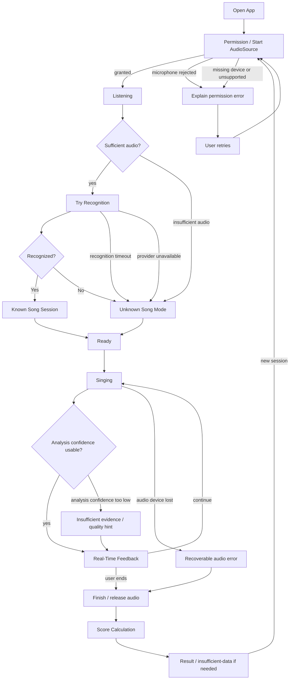

# 05 — User Flow

目標流程（尚未實作完整 state machine）。初次辨識有 timeout，不能無限卡住演唱；timeout 數值 TBD。Ready 為概念狀態，不預先決定是否多一道按鈕。

麥克風拒絕無法正常演唱分析，不能假裝可評分；辨識服務失敗則仍可演唱。低 confidence 與 Unknown Song 是兩個獨立概念：unknown 不是音訊無效，known 也不保證 pitch 可信。

停止時取消 pending tasks，晚到回應不得污染下一個 session。換歌／basic resync 的觸發、確認與分段策略見 UC-009、FR-017，TBD；不可把流程圖當成已批准的自動換歌算法。
