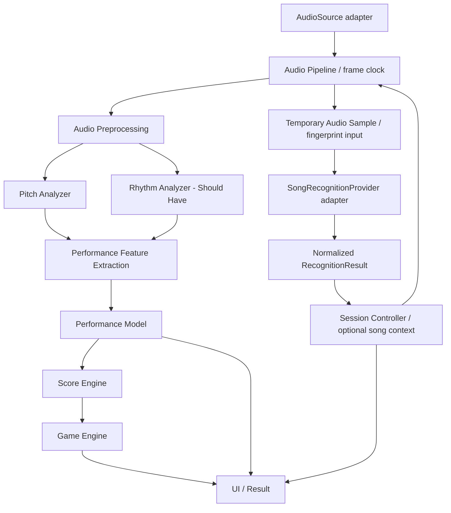

# 08 — System Architecture

## Existing Architecture — preserve

目前 `ktv-smart-scorer/` 是 native JavaScript ES modules + HTML/CSS，無 package manifest / bundler。現有 runtime 沒有外部套件 import；五個 tests HTML 透過 CDN 使用 fast-check。不是已完成的新產品架構。

| 現有位置（相對 repo root） | 觀察與保留價值 |
|---|---|
| `src` 以下皆在 `ktv-smart-scorer/` | 不搬動、不改名 |
| `src/audio/audioContext.js` | mic→bandpass→AnalyserNode、RMS gate、buffer reuse、stopAudio |
| `src/audio/pitchDetector.js` | 自相關 pitch、Hz/MIDI 轉換，未直接操作 DOM，可獨立測 |
| `src/scoring/scoreEngine.js` | note timeline、±0.5 semitone hit、+10 per evaluation；與 UI 分檔 |
| `src/ui/canvasRenderer.js` | Canvas pitch 可視化、DPR resize |
| `src/ui/lyricDisplay.js` | 逐字 timeline、只改變必要 spans |
| `src/main.js` | idle/loading/running/stopped/error；rAF 串接；ESP32 no-op hook |
| `assets/song_001/` | 5 秒 C3–G3 音階與 Do Re Mi Fa Sol 測試 JSON，不是完整歌庫 |
| `tests/test-*.html` | pitch、score、audio、canvas、lyrics 共五頁既有回歸測試 |
| `.kiro/specs/ktv-smart-scorer/` | 舊 requirements/design/tasks 完整保留，作歷史與追溯 |

## Target Modular Architecture — conceptual, not implemented

Recognition 是獨立路徑；metadata/offset 可供 session context，**不直接進核心評分公式**。即使 known 也不自動取得合法 note reference。未來若需要 reference-aware mode，必須另訂來源、同步與版本化介面，不能偷偷把 provider payload 注入 Score Engine。

AudioSource 管理取得／釋放來源；Audio Pipeline 統一 frames、時間與前處理；Pitch/Rhythm analyzers 只做分析；Performance Model 匯整 features 與品質；Score Engine 只做娛樂評分；Game Engine 只做事件／combo；UI 顯示結果；Session Controller 負責生命週期、取消與 orchestration。

MicrophoneAudioSource 可內部使用 navigator.mediaDevices，核心分析不可直接依賴它。File/LineIn/Mock/stream adapters 是可擴充方向，不在本次建立空殼模組。來源交付方式見 [interfaces](09-data-and-interfaces.md)。是否使用 Worker/AudioWorklet、backend 或新工具鏈均 TBD，不由圖推定。

## Potential Architecture Conflicts / Gaps

以下只登錄，不在本次 refactor。C-001–004 是優先會阻擋新 MVP 的差異；其餘為品質、範圍與待驗證事項。

| ID | Evidence | 與新規格差異 | 對照 / 後續動作 |
|---|---|---|---|
| C-001 | main.js start() 必須 fetch song_001 notes/lyrics，失敗即 error | 不符合 Any Song / unknown 無 reference 仍工作 | FR-010；後續隔離 demo assets，保留 fixture |
| C-002 | audioContext.js initAudio() 直接 getUserMedia，同時建立 pipeline | source acquisition 與 pipeline 耦合，無可替換 AudioSource | FR-002、FR-019；先做 contract spike |
| C-003 | main.js 每 rAF 呼叫 evaluate；scoreEngine.js 每 hit +10 | 分數受 render cadence / duration 影響，且依賴 target notes | FR-007；正式公式 TBD，不把 legacy 公式當新標準 |
| C-004 | detectPitch() 丟棄 bestCorrelation，回傳沒有時間／confidence | 無法讓 feature layer 做品質與連續時間判定 | FR-004；保留純函式，未來 adapter / contract 擴充 |
| C-005 | rAF 同時 DSP / score / UI；尚無 feature/game 模組 | 邏輯分檔已有價值，但 analysis cadence 綁 UI | FR-005–008、NFR-001；先量測再決定調度，非直接上框架 |
| C-006 | 沒有 recognition provider 或 unknown session state | 新需求未實作，不是既有供應商耦合 | FR-009、FR-010；不得假裝已有 AcoustID |
| C-007 | stop() 停在現有畫面；無 SessionResult | 沒有完整 result page、品質與 specVersion | FR-011；後續 bounded task |
| C-008 | 五頁 tests 用未鎖版 fast-check CDN；無 root LICENSE | 第三方 license / revision / maintenance 尚未審查；專案公開授權待擁有者決定 | REF-001、TBD-009；不推定 public 即授權 |
| C-009 | bandpass frequency=440、Q=3.5，註解聲稱約 80–1200Hz；M0 標準公式計算 half-power edges 約382–507Hz | 窄頻衰減其他音高，與 RMS gate 共同拒絕 quiet 220/880Hz；非 browser filter 實測 | NFR-001、FR-004；[M0 evidence](evidence/m0-audio-evidence.md)，尚未修 DSP |
| C-010 | initAudio() 取得 stream 後建 nodes；start() catch 未完整 teardown；close() 未 await | 初始化中途失敗可能殘留資源，需 error-path verification | FR-003、NFR-007；列風險而非宣称實機已重現 |
| C-011 | startTime=performance.now()；score/lyrics 用相對 ms | 已有相對時間基礎，但不是外部 KTV 播放位置；audio frame capture clock 未定 | FR-017；沿用相對 ms 概念，另有明確 offset mapping |
| C-012 | Kiro 要求逐字歌詞、MIDI target 與 ESP32 hook | 新 MVP 不需要歌詞／歌庫；硬體屬 Future，hook 只是 no-op | 保留歷史功能，不延伸實作；舊勾選完成不代表新 FR 完成 |
| C-013 | M0直接測正式detectPitch：2048時48k/220Hz全null；低頻會誤判；插值方向反號；weak fundamental會高一個octave | 音高range／confidence不足以代表正確性，不能宣稱已可靠涵蓋人聲 | FR-004；M0 F-001–005，未修復；後續獨立M2任務 |
| C-014 | 舊pitch測試用4096/44.1k且null可pass；audio測試複製gate邏輯 | 舊通過條件無法證明runtime window的coverage/cents或正式gate行為 | NFR-012；M0新增獨立harness直接測exports，保留舊tests |

## Migration boundary

本次只建立文件，runtime、tests、assets 與 Kiro 原檔不改。下一次只做核定 bounded spike。保留既有 audio/pitch/scoring/ui 分界，可逐步加 adapters，不整套搬 framework。修改公式或介面時同步 docs 與測試；衝突消除後更新本表狀態，保留追溯。

上段為初始化紀錄。後續 M0 已新增 test-only harness 與 [evidence](evidence/m0-audio-evidence.md)，既有 runtime/tests/assets/Kiro 仍未更改。最小 source→reader→frame→analyzer 提案已提出，尚未實作或 Accepted；M1先做生命周期與reader邊界，不併入DSP修正。
